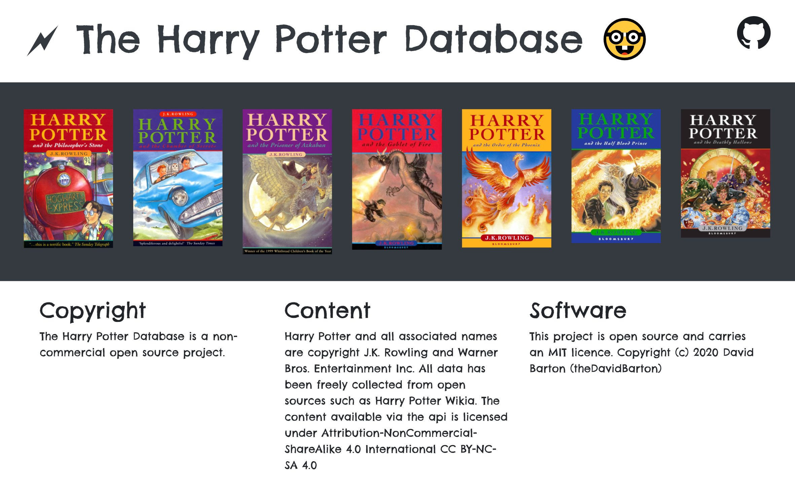

# the-harry-potter-database

🗲 A REST api to feed database about Harry Potter books.

# API docs

`GET`

/api/1/

/api/1/categories

/api/1/categories/{id}

`GET`

/api/1/books

/api/1/books/{id}

`GET`

/api/1/characters (optional parameter: search)

/api/1/characters/{id}

# Copyright

The Harry Potter Database is a non-commercial open source project.

## Content

Harry Potter and all associated names are copyright J.K. Rowling and Warner Bros. Entertainment Inc.

All data has been freely collected from open sources such as [Harry Potter Wikia](https://harrypotter.fandom.com/wiki/Main_Page).

The content available via the api is licensed under _Attribution-NonCommercial-ShareAlike 4.0 International_ [CC BY-NC-SA 4.0](https://creativecommons.org/licenses/by-nc-sa/4.0/)

## Software

This project is open source and carries an [MIT licence](LICENSE).

Copyright (c) 2020 David Barton (theDavidBarton)
